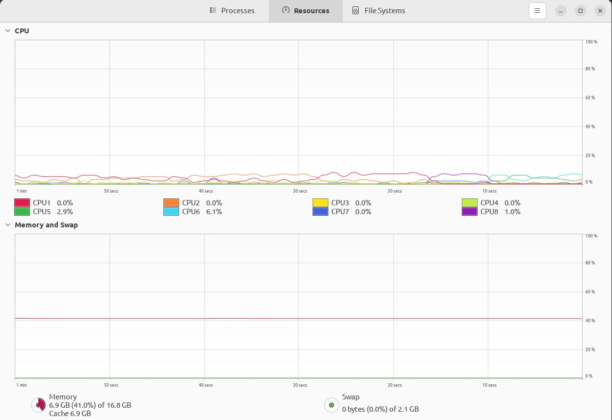
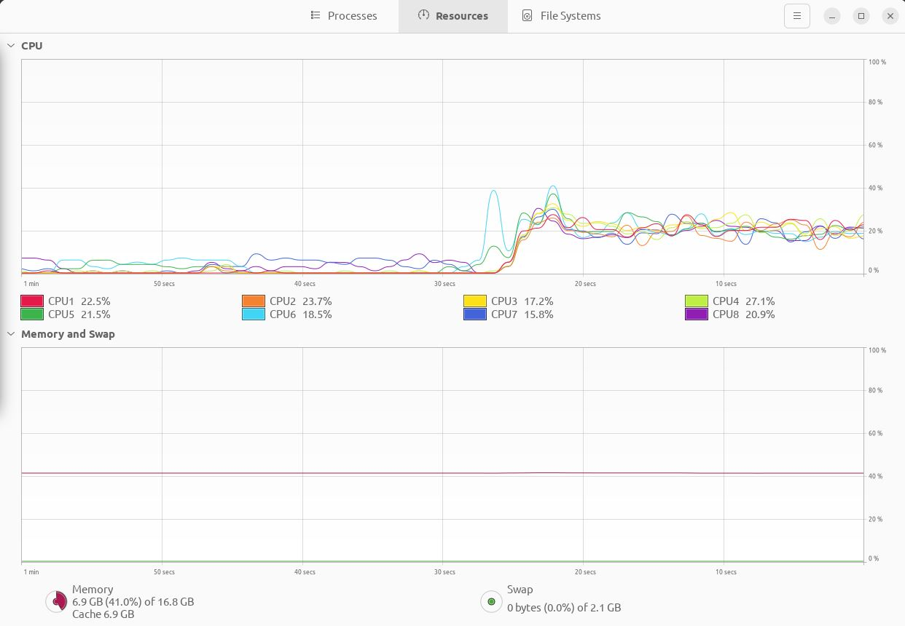

# Messari-Market-Data-Coding-Challenge
## Project Structure
```
.
├── asset
│   ├── asset_dto.go
│   ├── asset.go
│   └── service.go
├── cmd
│   └── messari-market-data-coding-challenge
│       └── main.go
├── data
│   ├── processed
│   └── raw
│       └── Binaries stdoutinator_amd64_linux.bin
├── .env
├── go.mod
├── go.sum
├── processor
│   └── service.go
└── README.md
```

## Build
```sh
$ go build ./cmd/messari-market-data-coding-challenge/.
```

## Run
```sh
$ ./messari-market-data-coding-challenge
```

## Timing
### Time to finish running trade objects stdout binary
```
time ./data/raw/Binaries\ stdoutinator_amd64_linux.bin

real	0m24.026s
user	0m11.151s
sys	0m13.936s
```

### Time to finish running solution
```
real	0m26.806s
user	0m21.226s
sys	0m32.323s
```

Difference is approximately 2.8 seconds.

## CPU and Memory Utilization of Solution
### Before


### After

